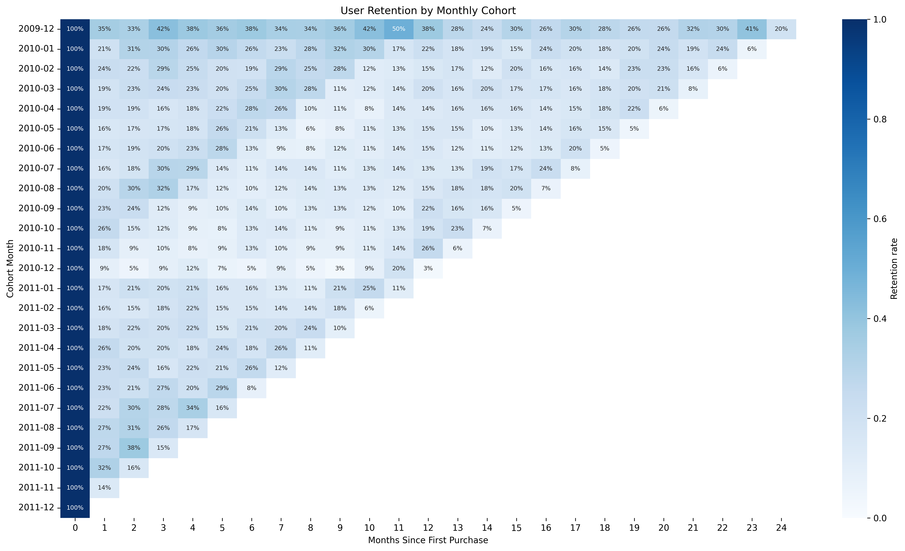
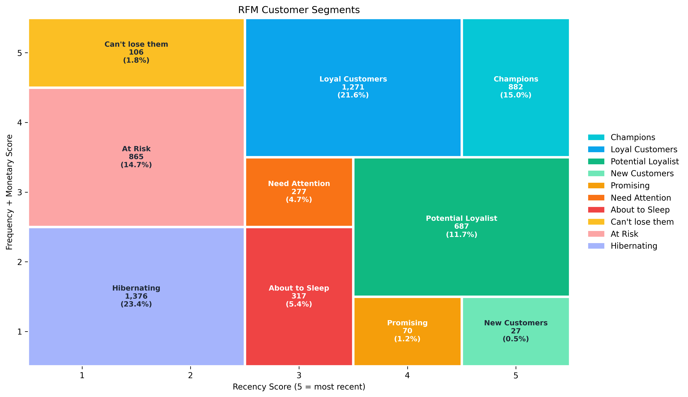
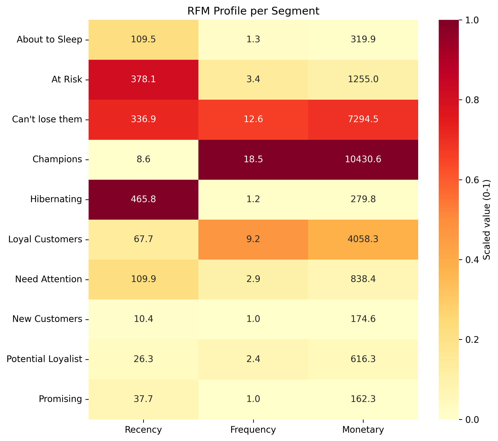

A customer analytics project built on the UCI Online Retail II dataset, a transaction log from a UK-based online retailer (1 Dec 2009 to 9 Dec 2011). The project measures how well customers are retained with monthly cohort analysis and groups customers by purchasing behavior with RFM (Recency, Frequency, Monetary) segmentation.

Objectives:
* Measure repeat-purchase behavior of customers over time (retention).
* Segment customers into groups that can be treated differently, as in analytical CRM.

# Data Cleaning
1) Removed records without a Customer ID.
2) Removed duplicate rows.
3) Converted InvoiceDate to datetime.
4) Removed rows with non-positive quantity or price (cancellations, returns, and accounting adjustments).

# Customer Retention
Customer retention analysis shows how well the business keeps customers after their first purchase. Customers are grouped by their first purchase month, so each group can be compared fairly at the same customer age, and it becomes clear when customers tend to drop off. Acquiring new customers is usually more expensive than retaining existing ones, since it requires marketing spend and promotions. Repeat customers also provide more stable revenue and higher lifetime value. Focusing only on acquisition can hide a retention problem, because customer counts may grow even while most new customers never return. Cohort analysis makes this visible and shows when customers drop off, so the business knows when to follow up.

## Process
1. Convert each invoice date into its order month, and each customer's first purchase date into the cohort month.
2. Calculate the cohort index, the number of months between the order month and the cohort month (month 0 is the first purchase month).
3. Count the unique customers for each cohort month and cohort index.
4. Divide each count by the cohort size (customers at month 0) to get the retention rate, stored in `user_retention`.
5. Visualize the result as a retention heatmap.

## Result

The cohort shows the share of each monthly cohort that purchases again in the months after their first purchase. Retention in month 1 is between 9% and 35% across cohorts, with most between 15% and 27%, and it generally declines as the months pass. The December 2009 cohort is the strongest, with 35% in month 1 and peaks of 50% in month 11 and 41% in month 23, both in November ahead of Christmas. Its higher retention likely includes existing customers whose first purchase predates the dataset. The low values at the end of each row are due to December 2011 being an incomplete month.

# Customer RFM Segmentation
Customer RFM segmentation groups customers by how recently they purchased (Recency), how often they purchase (Frequency), and how much they spend (Monetary). Treating all customers the same is inefficient, because their value and behavior differ widely: a small group of frequent, high-spending customers often contributes far more than occasional buyers. Segmentation identifies who the most valuable customers are, who is becoming inactive, and who has the potential to grow, so marketing budget can be focused where it has the most impact. Valuable customers can be rewarded and retained, at-risk customers can be targeted with reactivation campaigns, and low-value inactive customers can be given less spending.

## Process
1. Calculate the transaction value for each row (`Quantity x Price`) and set the snapshot date as one day after the last invoice date.
2. Calculate Recency (days since the last purchase), Frequency (unique invoices), and Monetary (total spend) for each customer.
3. Score each metric from 1 to 5 using quintiles, with Recency reversed so that 5 is the most recent.
4. Average the Frequency and Monetary scores into a single FM score.
5. Map customers into 10 segments using a defined grid of Recency score and FM score.
6. Summarize each segment and visualize the results as a segment grid and a profile heatmap.

## Result

Champions and Loyal Customers together make up 36.6% of the 5,878 customers, while Hibernating, At Risk, and Can't lose them, who have not purchased recently, account for 39.9%. The remaining segments are smaller, and New Customers (0.5%) and Promising (1.2%) are the smallest.

Champions are the strongest segment on every measure, with the most recent purchases at about 9 days, the highest frequency at about 18.5 invoices, and the highest spend at about 10,431, more than 30 times the average spend of Hibernating customers at about 280. Loyal Customers follow with about 9 invoices and about 4,058 in spend. Can't lose them spend heavily, at about 7,295 across about 12.6 invoices, but last purchased about 337 days ago, making them the most valuable of the groups that have not purchased recently. At Risk and Hibernating customers have the longest recency at about 378 and 466 days, with much lower spend. New Customers and Promising are recent but have only about one invoice and the lowest spend at about 175 and 162.
